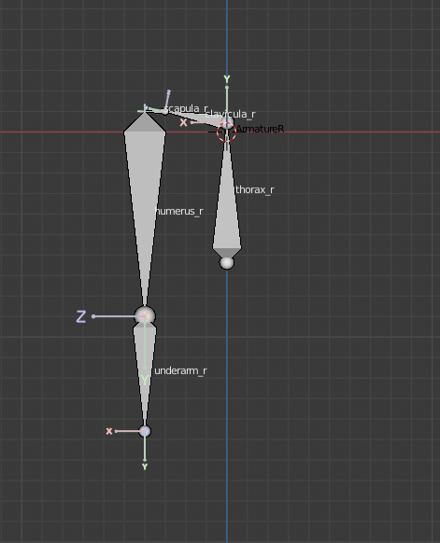
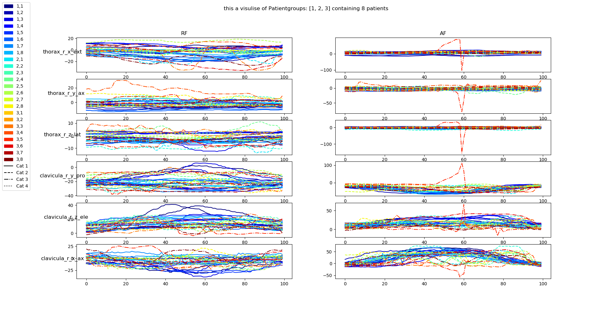

# Data-Science-Minor
This is the personal portfolio for The Data Science Minor at THUAS by Raphael Pickl (19076460).


# Table of contents:
- [1. Introduction](#1-Introduction)  

- [2. Learning on Machine Learning](#2-Learning-On-Machine-Learning)
  - [2.1 DataCamp and Udemy Courses](#21-DataCamp-and-Udemy-courses)  
    - [2.1.1 DataCamp](#211-DataCamp)
    - [2.1.2 Udemy](#212-Udemy)
  - [2.2 First Steps With our Data](#21-First-steps-with-our-Data)
  - [2.3 Data Preprocessing](#23-Data-Preprocessing)
    - [2.3.1 Logistic Regression](#231-Logistic-Regression)
    - [2.3.2 Neural Networks](#232-Neural-Networks)
  - [2.4 Understanding Last Groups Work](#24-Understanding-last-groups-work)
  - [2.5 Jupyter Notebooks on Machine Learing](#25-Jupyter-Notebooks-on-Machine-Learing)
- [3. Visualization](#3-Visualization)
  - [3.1 Blender](#31-Blender)
    - [3.1.1 Creating a Wireframe Model in Blender](#312-Creating-a-Wireframe-Model-in-Blender)
    - [3.1.2 Refining the Blender Model](#312-Refining-the-Blender-Model)
    - [3.1.3 Creating our own Protocol](#313-Creating-our-own-Protocol)
      - [3.1.3.1 The Protocol](#3131-The-Protocol)
      - [3.1.3.2 The Outcome](#3132-The-Outcome)
  - [3.2 Matplotlib](#32-Matplotlib)
    - [3.2.1 Plotting the CSV's in 2D](#321-Plotting-the-CSVs-in-2D)
    - [3.2.2 Plotting RAW and CSV files](#322-Plotting-RAW-and-CSV-files)
  - [3.3 Checking for Flipped Sensors](#33-Checking-for-Flipped-Sensors)
  - [3.4 Poster for Zoetemeer](#34-Poster-for-Zoetemeer)
- [4. Research](#4-Research)
  - [4.1 Answering the Subquestions](#41-Answering-the-Subquestions)
  - [4.2 Writing a Paper](#42-Writing-a-paper)
  - [4.2.1 Starting Structure](#421-Starting-Structure)
- [5. Presentations](#5-Presentations)
- [6. Conclusion and Reflection](#6-Conclusion-and-reflection)
  - [6.1 STARR](#61-STARR)

# 1. Introduction
In the extent of the Applid Data Science Minor 2019/20 at The Hague University of Applied Sciences I, Raphael Pickl, was working on a project called Ortho eyes. 
Here is a `link` to the research paper that was the main outcome of the project. The introduction in the paper gives enough information on what the project was about and what the startign ground for our research was.

# 2. Learning on Machine Learning
In this chapter my personal development in Machine Learing gets discussed.  
Which courses and what actions did I take to improve on my Machine Leaning skills.
## 2.1 DataCamp and Udemy Courses 
## 2.1.1 DataCamp

In the first weeks of our project, we planned one day a week for the Datacamp courses. Since I already had a small coding project in Python, which was self-thought, the year before, I already knew the basic syntax of the language. Though, having a structured course layed out, which shows one the proper techniques, which are used in the Machinelearning field really improved my skills..  

  

From week to week I felt more secure in the language, and I was able to make use of the API’s that got introduced to us in the course. Especially working in Data Science shows the beauty of an object orientated coding language like python. With the right API’s like Numpy and SKLearn it’s possible to attack unimaginable big problems with just a few lines of code. 

## 2.1.2 Udemy
I was able to score a good deal on one of the Udemy courses on Neural Networks with Tensorflow 2.0. Instead of over 100 Euros it was discounted to around 15 Euros. That's why I thought it wouldn't be a bad idea to improve my ML skills through a different course than the one at THUAS. I didn't want to get better with NN's for nothing, at this point of the project we wanted to start with CNN's, which this course gave a good introduction to.  


For what it's worth, I was able to work through 67% of the course, which was enough to get a good understanding on what neural networks actually are and how they interprete the data we supply.  
By the time I was finished with the course, I was more familiar with machine learning in general. I learned a lot about the model in general, objective functions, optimazation algorithms, Tensorflow, under- and overfitting, early stopping and of course preprocessing of the data in general.  
- [Notes Udemy](2.Learning_on_Machine_Learning/2.1.2_Udemy/Notes_Udemy.pdf)  
## 2.2 First Steps With our Data


After I got to know our data through the experiments in Blender, where at this point I was only able to load in one file at a time, I decided to read some basic information from the data. Instead of only using one file at a time, I wanted to calculate the mean for one axes, the X-axes of the right thorax, for all of the files contained in one given folder. Eventhough the mean of a dataframe can easily be calculated with the df.mean() function, I found this exercise really helpful, because it helped me understand the datastructure and it's dimensions. Also it got me used to working with classes and functions without getting to complicated for the beginning.

 
```python
from parserr import Parser
import pandas as pd
import os 

directory = 'D:\\Hochschule\\5_Semester\\Orthoeyes\\Data\\test-data\\test\\'

df_result = pd.DataFrame

def get_data(directory):
    datalist = []
    for filename in os.listdir(directory):
        if filename.endswith(".csv"):
            datalist.append(Parser(directory+filename))
    return datalist

def get_mean(df, part):
    var = 0
    for value in df['thorax_r_x']:
        var += value
    mean = var / data.dataframe_size()
    return(mean)

for data in get_data(directory):
    df = data.get_bodypart('thorax', 'r')
    print(get_mean(df, 'thorax_r_x'))
```
*This code was copied out of [test.py](2.Learning_on_Machine_Learning/2.2_getting_to_know/test.py) in [2.2_getting_to_know](2.Learning_on_Machine_Learning/2.2_getting_to_know)*   
<br>
<br>
In this script there are only two functions used: `get_data()` and `get_mean()` . 
`get_data()` makes use of the parser class, to get back a list of all the dataframes in the directory. `get_mean()` calculates the mean of one column in a dataframe.   

At the end of the script I simply loop trough the whole datalist to get all the means of all the files. The printout isn't really pretty, but since it was more a proof of concept it worked for me:  
```
  python3 d:/Hochschule/5_Semester/Orthoeyes/Portfolio/Machine Learining/getting_to_know/test.py  
  7.107194803858595  
  4.41344972577624  
  0.9291094629136488  
  -2.493449629363173  
  -0.9359113076469754  
  5.993412983976696  
```


## 2.3 Data Preprocessing

## 2.3.1 Logistic Regression


At this point of time, I already worked with our data quite a bit, I plotted some easy graphs, I created my own anymations in Blender, and I could load in different files at once.  

Now I wanted to load in the data to feed it to any ML model, but not by storing all the data in the memory, but by saving only the paths to the data in memory, to safe a lot of computing power. The whole groups agreed on this standard, so it was everybodys responsibility to get used to coding like this.   

In main_raphi.py I was able to make use of the already written controller scripts, that were implemented in the main branch of our GitHub repository. Unfortunatly I didn't get further than just loading in the data. 

```python
from controller.datacontroller import DataController

from ml.models import Models
from ml.logisticregression import LogisticRegressionModel
from ml.svc import SVCModel


class config:
    debug = False
    tables = True
    pp = pprint.PrettyPrinter(indent=4)

    exercises = 5
    workers = 20
    max_chunck_size = 100

    test_size = 0.2
    test_random_state = 42

    if debug:
        basepath = "src\\data\\cleaned-regrouped-small\\"
    else:
        basepath = "src\\data\\cleaned-regrouped\\"

print('ORTHO: Prepairing Dataset')

controller = DataController(config)
controller.run()
```
*This code was copied out of [main_raphi.py](2.Learning_on_Machine_Learning/src/main_raphi.py) in [src](2.Learning_on_Machine_Learning/src)*   

The moment I got this script working, our main structure in the master branch changed again, so I continued working with the code that was already supplied by my colleges. In [src2/main.py](2.Learning_on_Machine_Learning/src2/main.py) A `np_combination_train` and `np_combination_test` gets created. Those are `X` and `y` for the most of the machinelearning models. This is the first time, I used this data structure that was planned for the model from the beginning, even from the last group.  


*This image shows the general  data shape we've been using for machine learning*

## 2.3.2 Neural Networks

Also to mention is that  I prepared some data together with Hassan (both working on one Laptop, taking turns every now and then), not for the Logistic-Regression-Model but for the CNN we’ve been training.  

- *All the code can be found in [2.3.2_NN/src](2.Learning_on_Machine_Learning/2.3.2_NN/src) where [CNN.py](2.Learning_on_Machine_Learning/2.3.2_NN/src/CNN.py) is the main.*   


At first it was thought, that we’re going to use an RNN as an supervised training method, but we decided to use a CNN instead. That is because of the data structure we’re working with. Since there is, for every bone in every patient, an X Y and Z Euler-Angle, we can put these three values in one RGB pixel. Eventhough it isn’t necessary for a Nural Network to have an input like this, we thought it would be a nice way of preprocessing the data, without loosing any of the information. In order to achieve something like this, the rotation first need to be normalized and the mapped on a scale from 0 to 1.  
## This is a visual representation of the inputdata for the CNN
  
*Every column is a bones combined `X`,`Y`,`Z`, where 8 bones (8 columns) are one exercise of one patient. The rows are the length(frames) of one exercise. Given the fact that one patient did 5 exercises over a resampled length of 40 frames: this picture is (8*5)px x 40px. 

As it is already described in the picture above, the “width” of the inputdata are the eight bones of the upper body, for 5 different exercises performed by one patient. Therefore one picture is one iteration of all the exercises one Patient has done( AB1, AF1,RF1,AH1…) the arrays shape is (40,100,(3)) Where 40 is 8 bones * 5 exercises and the 100 is the resampled framecount(length of exercise) the third(3) dimension is represented in the picture by the colour at the given pixel. These tensors then get stored in one bigger Tensor, which then gets fed to the CNN.

I worked with Hassan, to get a good ground for the CNN's. The moment we got a somewhat decent model running, we decided, that only one person should contiunue on the subject. That is why, the outcomes you can see here, are not the best, but they are mine!

```console
"d:/Hochschule/5_Semester/Orthoeyes/Portfolio/Machine Learining/NN/src/CNN.py"
Importing patients from: d:\Hochschule\5_Semester\Orthoeyes\Portfolio\Machine Learining\NN\data/Category_1
100%|█████████████████████████████████████████████████████████████████████████████████████████████████████████████████████████████████████████████| 30/30 [00:11<00:00,  2.67it/s]
Importing patients from: d:\Hochschule\5_Semester\Orthoeyes\Portfolio\Machine Learining\NN\data/Category_2
100%|█████████████████████████████████████████████████████████████████████████████████████████████████████████████████████████████████████████████| 39/39 [00:10<00:00,  3.59it/s]
Importing patients from: d:\Hochschule\5_Semester\Orthoeyes\Portfolio\Machine Learining\NN\data/Category_3
100%|█████████████████████████████████████████████████████████████████████████████████████████████████████████████████████████████████████████████| 37/37 [00:10<00:00,  3.58it/s]
train_combinations:  819
test_combinations:  275
100%|██████████████████████████████████████████████████████████████████████████████████████████████████████████████████████████████████████████| 275/275 [00:02<00:00, 126.37it/s]
(275,)
100%|███████████████████████████████████████████████████████████████████████████████████████████████████████████████████████████████████████████| 819/819 [00:19<00:00, 42.68it/s]
2020-01-12 12:19:31.812072: I tensorflow/core/platform/cpu_feature_guard.cc:142] Your CPU supports instructions that this TensorFlow binary was not compiled to use: AVX2
Model: "sequential"
_________________________________________________________________
Layer (type)                 Output Shape              Param #
=================================================================
conv2d (Conv2D)              (None, 97, 37, 16)        784
_________________________________________________________________
max_pooling2d (MaxPooling2D) (None, 48, 18, 16)        0
_________________________________________________________________
conv2d_1 (Conv2D)            (None, 45, 15, 32)        8224
_________________________________________________________________
max_pooling2d_1 (MaxPooling2 (None, 22, 7, 32)         0
_________________________________________________________________
conv2d_2 (Conv2D)            (None, 19, 4, 32)         16416
_________________________________________________________________
flatten (Flatten)            (None, 2432)              0
_________________________________________________________________
dense (Dense)                (None, 32)                77856
_________________________________________________________________
dense_1 (Dense)              (None, 3)                 99
=================================================================
Total params: 103,379
Trainable params: 103,379
Non-trainable params: 0
_________________________________________________________________
Train on 819 samples, validate on 275 samples
Epoch 1/10
2020-01-12 12:19:35.194058: I tensorflow/core/profiler/lib/profiler_session.cc:184] Profiler session started.
819/819 [==============================] - 2s 3ms/sample - loss: 0.6006 - accuracy: 0.7888 - val_loss: 0.3144 - val_accuracy: 0.9309
Epoch 2/10
819/819 [==============================] - 1s 2ms/sample - loss: 0.4129 - accuracy: 0.8376 - val_loss: 0.2905 - val_accuracy: 0.9200
Epoch 3/10
819/819 [==============================] - 2s 2ms/sample - loss: 0.2165 - accuracy: 0.9304 - val_loss: 0.1461 - val_accuracy: 0.9455
Epoch 4/10
819/819 [==============================] - 1s 2ms/sample - loss: 0.1013 - accuracy: 0.9597 - val_loss: 0.1298 - val_accuracy: 0.9527
Epoch 5/10
819/819 [==============================] - 1s 2ms/sample - loss: 0.0660 - accuracy: 0.9707 - val_loss: 0.3843 - val_accuracy: 0.8873
Epoch 6/10
819/819 [==============================] - 1s 2ms/sample - loss: 0.0506 - accuracy: 0.9744 - val_loss: 0.1434 - val_accuracy: 0.9200
Epoch 7/10
819/819 [==============================] - 2s 2ms/sample - loss: 0.0448 - accuracy: 0.9756 - val_loss: 0.1129 - val_accuracy: 0.9455
Epoch 8/10
819/819 [==============================] - 1s 2ms/sample - loss: 0.0306 - accuracy: 0.9866 - val_loss: 0.1464 - val_accuracy: 0.9164
Epoch 9/10
819/819 [==============================] - 1s 2ms/sample - loss: 0.0322 - accuracy: 0.9841 - val_loss: 0.1686 - val_accuracy: 0.9055
Epoch 10/10
819/819 [==============================] - 1s 2ms/sample - loss: 0.0209 - accuracy: 0.9976 - val_loss: 0.4133 - val_accuracy: 0.8945
275/1 - 0s - loss: 0.7360 - accuracy: 0.8945
0.89454544
```  


## Evaluation 
The graph shows the accuracy of the train and test set, in the printout the loss of the train and test set can be seen. By looking at the graph one can see, that the test and train set start to stray apart from each other at epoch 3. In loss for both sets is still going down until epoch 7. But in general you could say, that the model is overfitting, especially after epoch 3. This is beacuase of the size of the layers in the model and the fact, that we haven't cleaned the data properly at this point(so there's bias in some patientgroups). Also it might be a problem, that we're feeding all the patients exercises at once. And it needs to be adressed, that we ( Hassan and I) only used 3 out of our 4 patientgroups, because of problems with the dataset.


As I said, it is not the best possible outcome for a model, but these results let us guess, that there is sufficient information in the data to do classification. Now it was in Hassans hands to find the best architecture for the CNN, even though he often relied on my educated guess on whatever the outcome of a model was good or not. 


## 2.4 Understanding last Groups Work


In order to get everybody on the same page with their machine learning skills by week 10, we created a task, as a researcher I want to understand the steps the last group took. Therefore we created a Excel sheet to keep track on progress.   

  

*[MachineLearning_progress.xlsx](2.Learning_on_Machine_Learning/2.4_understanding_last_group/MachineLearning_progress.xlsx)*

This task contains multiple subtasks, that have either been completed just to complete the subtask or in order to accomplish something else in the project. Here I will give links to the sections in my portfolio where I completed those tasks.  


| Task | link |
| --- | --- | 
| Read in a simple dataset in python | [3.2.1 Plotting the CSV's in 2D](#321-Plotting-the-CSV's-in-2D)|
| 2D Visualization | [3.2.1 Plotting the CSV's in 2D](#321-Plotting-the-CSV's-in-2D) |
| Train simple model | [Outcommented code at the bottom of file](2.Learning_on_Machine_Learning/src2/main.py) |
| Understand result from last analysis | [2.4 Understanding Last Groups Work](#24-Understanding-last-groups-work) | 
| Train calssification model | [Outcommented code at the bottom of file](2.Learning_on_Machine_Learning/src2/main.py) | 
| Redo analysis from last year with the new data | [Outcommented code at the bottom of file](2.Learning_on_Machine_Learning/src2/main.py) |
## 2.5 Jupyter Notebooks on Machine Learing


In preparation for the test, I started working through all the Machinelearing Notebooks provided on the datascience server. Therefore, I simultaneously had the lecture and the notebook open, this way I was able to understand and see the techniques used in the lectures by myself on my own computer. The given problems were built up gradually and of course followed the weekly lectures in the same paste.  

Since our Dataset was quite different than for example the MNIST or other examples used throughout the lectures, it was quite hard to make the transition from big and structured datasets to ours, which is really small and only contains features that are from the same type. Nevertheless it was a good practice and it helped me understand the bigger picture of Data Science. 


# 3. Visualization

## 3.1 Blender

## 3.1.1 Creating a Wireframe Model in Blender


Before any sort of a model could be created, it was upon me, to figure out what the data actually means. With some information from the LUMC and a paper describing the WU standard for Euler Angles in bone structures, I came up with a [factsheet](3.Visualization/3.1_Blender/Overview_Axes_LUMCvsWU.pdf) to describe which columns is responsible for which bone and in this bone which axes.  


  

*The left side of the `factsheet` is the labeling standart the LUMC is using, which is based on the WU standart. On the left side the axes order goes from `top` to `bottom`, on the right side a better illustration, but with different axes names can be seen.*

Afterwards, the struggle to find the best “resting position” for the armature(the skeleton) began. This basically went down through trial and error. I first started with only one side(right side) and if I saw movement that made sense for my eyes I tried to construct the left arm based on the right one. 




## 3.1.2 Refining the Blender Model

- Add Blender Screenshots here  

In the second phase of the refinement, I added functions, to sort the different armatures in the scene, by either their exercise- or patient-group. I also automated the script to load in multiple files at the same time. Basically the script was created to function by the click of one button.  
```python
for obj in bpy.data.collections['Result'].objects:
    if grouping == 'cat':
        name = obj.name[:4]
    if grouping == 'pat':
        name = obj.name[5:10]
    if name not in col:
        newCol = bpy.data.collections.new(name)
        bpy.context.scene.collection.children.link(newCol)
        col.append(name)
    bpy.data.collections[name].objects.link(obj)
    bpy.data.collections['Result'].objects.unlink(obj)    

```
- I created a [instructions_how_to_blender](3.Visualization/3.1_Blender/instructions_how_to_blender.pdf) so that every group member could make use out of my script  
 

The user is able to choose which files he/she wants to read in, and by what the user wants to order the different “patients”.  
```python
rotation_mode = 'XYZ'
grouping = 'cat'
directory = 'D:\\Hochschule\\5_Semester\\Orthoeyes\\Data\\test-data\\'
```
After all the animations have been created, one has the possibility to switch into the orthographic view, in order to compare the different “patients” without having any perspective issues.  
<br>
*orthographic view*
  
*perspective view*

This way of view the “patients” enables the possibility to see the exercises in 2D and 3D but also with and without perspective(with perspective helps to understand the movement, without makes it easy to compare the “patients to eachother”), all this can be done in realtime and full moveability of the camera in the same viewport.  

## Result:  
The Euler angles were in the way of getting a proper visualization. We also didn’t want to make more assumptions than we needed too. The [outcome](#3132-The-Outcome) of the next chapter goes more in depth on what the results were. 


## 3.1.3 Creating our own Protocol

### 3.1.3.1 The Protocol


In order to validate the 3D visualization made in Blender, we either needed to check back with our client at the LUMC and get a verification that the animations are correct. The other possibility was, to create our own exercises, which one of the group members would perform while hooked up to the same Flock of Birds system, that has been use to collect the patient data we received, at the LUMC.  

To make sure, that the exercises will be performed exactly how I envisioned them beforehand, I created a [protocol](4.Research\PNG\LUMC_protocol_empty.pdf). This protocol contains hand drawn descriptions of the exercise and also step by step instructions for the “patient”. We didn’t want to rely on filenames and the protocol, we also filmed all the execises that had been performed by our group at the LUMC.


### 3.1.3.2 The Outcome


Once we visited the LUMC and recorded our own movement data, It was about time to validate the script I created earlier. The first step was, to cut the recorded video files to the right length and name them with the corresponding filenames of the .CSV – files.  

Even though we had a protocol, to keep track in which order the tasks have been performed, it still was wearisome work, because this wasn’t the time for mistakes, since the recording should proof the reliability of the script that was planned to be used to label our dataset. To Accomplish this task I used Adobe Premiere.  


After hours of trial and error, I came to the conclusion, that I won’t be able to get a proper representation of the data, using Blender. That’s because of the Euler Angles that are used to describe the patients movement. In the Euler Angles nature lays, that the three angles can only describe ONE rotation in 3d space. This only applies, if the three axes are staying in the same order. This being said: `X` = 34°, `Y` = 45°,  `Z` = 180° is different to : `Z` = 180°, `X` = 34°, `Y` = 45°. 
For whatever reason, this order needed to be switched for different exercises in Blender. But I could see the corealation at some points but not good enough so I didn't want to make any assumptions, because this script was seen as a tool to find errors in the data.

## 3.2 Matplotlib

## 3.2.1 Plotting the CSVs in 2D
- code is in [*visualize.py*](2.Learning_on_Machine_Learning/src2/fd/visualize.py) 
-  Commit 42948dc5  

After I made my first contact with the data in Blender and some minor experiments with Machinelearning, I started creating some scatterplots, to further understand the data.  

```python
from fd.visualize import Visualise_patient

Visualise_patient(patient_group, patientnr=[1],right = True, left = False, linelabel= True)
Visualise_patient.plot()
```
*This code was copied out of `main.py` in [src2](2.Learning_on_Machine_Learning/src2/main.py)*

In src2[*/main.py*](2.Learning_on_Machine_Learning/src2/main.py) a visualization gets shown, after the training and test data gets created. This visualization shows the data exactly how it gets handed to a machine learning model.  


This graph was more a proof of concept, than an actual tool for visualization. This came, when I integrated the Visualization class into the main branch. At this point of the project we realized that patientgroup 4 we received from the LUMC wasn’t what we expected it to be(thanks to the [visualizations](3.Visualization/PNG/123vs4) I created). The values in pg4 were completely different, then the ones for patientgroup 1-3. 


In order to contribute to the project, I created a class Visualize in the master branch, that anybody could make use of, just by turning it on in the config and by changing a few parameters in the definition of the class. 

```python
if config.show_visualization:
    vv = Visualize(patient_groups,catagory = [1,2,3], patients=[1,2,3,4,5,6,7,8], exercises=['RF','AF'], bones=["thorax_r_x_ext", "thorax_r_y_ax", "thorax_r_z_lat",
                      "clavicula_r_y_pro", "clavicula_r_z_ele", "clavicula_r_x_ax"])
    vv.visualise(mode='exercise')
    vv.visualise(mode = 'idle') 
```
*This code was copied out of `main.py` in [src](3.Visualization/3.2_Master2.0Branch/src/main.py)*  
  
<br>  

The user can choose which Petientgroups, out of these groups which patients, what exercises and what bones should be displayed in the graphs. If none of the parameters gets set, the script will grab all the information out of the config. Also the length of the exercise doesn’t matter, since the script gets all it’s information out of the config.  
- code is in [*visualis.py*](3.Visualization/3.2_Master2.0Branch/src/tools/visualis.py) 
  

*The visualize_exercise function compares different exercises between Patientgroups and patients and bones.*

 

The visualize_idle function was created to help validate Hassans script to remove the idle at the end and the beginning of every exercise. In this graph one patients exercise gets it's own subgraph, keep in mind there are most of the times two itterations of every exercise, thats why two line are plotted in the subplot. Therefore the two line have a different color, just as the responding "idle" lines.


## 3.2.2 Plotting RAW and CSV files

- code is in [*visualiseraw.py*](3.Visualization/3.2_Master2.0Branch/src/tools/visualiseraw.py) 

All the efforts to get a real 3D visualization in Blender didn’t bring any good results and just let us continue guessing. Since Assumptions aren’t any good in machine learing, we needed a visualization that we could trust. Therefore Eddie wrote a script, based on the last groups work, to visualize the RAW files we received from the LUMC. I used this as a base for my script. Eddies effort is the 3D graph at the top, mine was putting it all together) 


This script was most and foremost created to understand fully what exercises contain which movent in Euler Angles. Therefore replacing the effort that was made to create a 3D animation in Blender.  
This script also served as the base for work that was done by Lennart to find wrongly named exercises in the files. 


## 3.3 Checking for Flipped Sensors


For anomaly detection we wanted to make sure, that the way the sensores are attached to the patients doesn't mess with the data. Therefore we did one set of exercises at the LUMC with a flipped sensor on the right humerus. 


Upon visual inspection there is no significant difference between the first and the second recording of Raphaels normal exercises.(keeping in mind, that the sensor was flipped on the Humerus alone)

## 3.4 Poster for Zoetemeer

Our group was asked to show our project at the campus at Zoetemeer, for this event I designed a [poster](3.Visualization/PNG/Poster_Ortho_EyesV7.pdf).  

Unfortunatly the only person that got in contact with us in Zoetemeer, was Eerwin Vlugt, to whom we talk to already at different occasions. This was due to the space were we could put up our stand, it wasn't organized properly, so simply nobody we could talk to came by.


# 4. Research
    To what extend and in what way, can different supervised data science  
    techniques be used on kinematic recordings to contribute to a more valid  
    and more reliable diagnosis, made by a doctor, on shoulder disability?
## 4.1 Answering the Subquestions
At the beginning of the project, we had some lectures about research, in these lectures we learned how to come up with a researchquestion and how we can asnwer it by using more simplyfied subquestions. 
Since we didn't have much domain knowledge in the beginning, it made a lot of sense to start working on the library and field questions.  


It was everybodys task to pick at least on of the question, find a researchpaper that describs the problem or even answers it. These results should be saved somewhere, so that the other group members have acces to the summaries.  
[Here's](4.Research/4.1_Answering_the_Subquestions) my contribution to this task.


## 4.2 Writing a paper


## 4.2.1 Starting Structure
I was the first person in the group who started working on the research paper. Thats why one of my first tasks was, to understand what a researchpaper actually is and how one goes about writing one. 

- paper here  


In [Paper_guide_by_Raphi.docx](4.Research/4.2_Writing_a_paper/4.2.1_starting_structure/Paper_guide_by_Raphi.docx) is a brief summary of "how to write a good paper" with some more in depth explanation of for example difficult terms. 

I also came up with a general guide on how the writing process should go about: 

```
General Strategy:
-Gather all the information we need for the paper. 
-Start with the conclusion and work from there to the top. 
-Planned are 5 iteration in order to get to a finished state of the paper
1. structure
2. dropping anything in the paper(start writing sentences)
3. write actual sentences and add figures
4. check references etc.
5. finished paper, check typos
```
For the first point: "1. structure" I started with a very simple version and improved it over multiple itteration. These files can be found [here](4.Research/4.2_Writing_a_paper/4.2.1_starting_structure/1.structure).

# Outcome vs researchquestion and what was my part
# 5. Presentations
Here's a list of presentations I was working on during this semester:
- [week 1](5.Presentations/Ortho_week1.pptx)
- [week 8 open presentation](5.Presentations/OpenPresentation_2_week8.pptx)
- [week 12 open presentation](5.Presentations/OpenPresentation_3_week12.pptx)
- [how to blender](3.Visualization/3.1_Blender/Visualisation.pptx)

# 6. Conclusion and Reflection

# 6.1 STARR
  
## What did I do?

| S | T | A | R | R | 
| --- | --- | --- | --- | --- |
| At the beginning of the project we didn’t have labeled exercises. The exercises were just labeled 1 till 7. But we couldn’t be sure that exercise 1 for different patients contains the same movement. | I took the task on myself to create visualization in Blender to get a proper animation of the data in 3D, so that we could be sure what exercises were what. | I did research on the Euler angles and the gimbal lock, and I learned a lot about scripting in python in general but also in Blender. In the end I created a mixed 2D and 3D visualization. | The result was a factsheet that explained the domain of Kinematic recordings at the LUMC. I found out that Blender isn’t the right tool so I switched back to matplotlib. | While trying to visualize the data, I got to know the data structure pretty good, I also cleared up some assumptions on the column labels by creating the factsheet. I also learned the importance of presenting your outcomes to the rest of the group, otherwise the work is only done for one person. |  

## What did I learn?
| S | T | A | R | R | 
| --- | --- | --- | --- | --- |
| The general drive in the group wasn’t as good as it could be: People weren’t arriving on time and when they arrived, they made no effort in contributing to the project. | I was tasked to be the contact person for the LUMC, while somebody else was the SCRUM-master and another person was responsible for the repository.  | In order to push the motivation of the group passively I arrived on time every morning. This gave me the opportunity to ask the group members about their tasks and what they’re doing. I also did a good part of the general planning and sometimes even filling the backlog. Holding the daily standups was also mostly me being pushy to the rest of the group. | I made myself responsible for more than I needed to, because I felt like nobody else would do it. This led to exactly what I was fearing: The rest of the group also relied on my planning and structure. But also on keeping track with their progress with their tasks. | Around week 15 I felt the pressure on myself getting bigger, which led me to become more quiet in the group, coming in later and I stopped asking my colleges about heir tasks. I also didn’t insist on the standup anymore. I would describe myself as a leading personality, this semester I learned how to work with that. When things started going in the wrong direction for the project I made myself responsible for the problem, instead of getting them started to think in the right direction by themselves, I already thought for them. This developed to become more and more the norm, until the point were I felt like the only person who is able to do their own thinking and decision making in the group. At this point I could say for sure, that the project wouldn’t have made it to the end of the semester, if it weren’t for me. Thankfully I recognized this behavior by Christmas, and was then able to slowly get myself back out of this position, by just keeping my head low, even if it meant for the project to go on more slowly than it could have been. We don’t have the best results, but at least I could keep my sanity.

## What did we learn?
| S | T | A | R | R | 
| --- | --- | --- | --- | --- |
| We as a project group were using SCRUM as an organization tool, even though we had nobody to take the spot of the Product owner. That is because we’re doing research and Tony was our “teacher”. | We needed to come up with a main research question, but also with some subquestions and an epic, to at least give the impression, that we are working with a product owner. | In order to find research questions, we first of all did some research on research and then we brainstormed to find out where this research should head in the future. Also an epic got created by Tony, to help us find a research question.  | The result of this was, that we had sub and a main research question and also the epics, but still nobody who kept track or at least asked us if we’re still on the way, the product owner has intended. This lead to us, loosing focus on what needs to be done. | Since we didn’t have a product owner that checked up on us a couple of time throughout the project, it was really hard to define for ourselves, what work is actually important and in what directions we should head in order to finish the project. Therefore we can be really happy with the outcome of the project, and we can be proud that we made it to the end.  |

